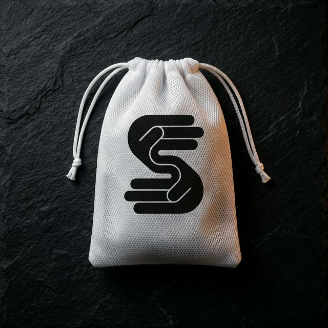
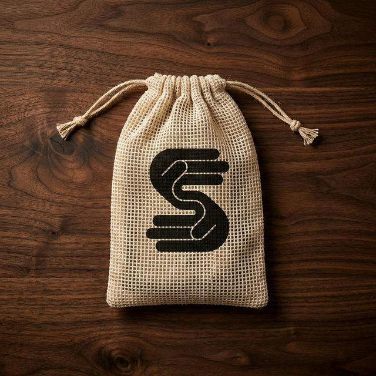
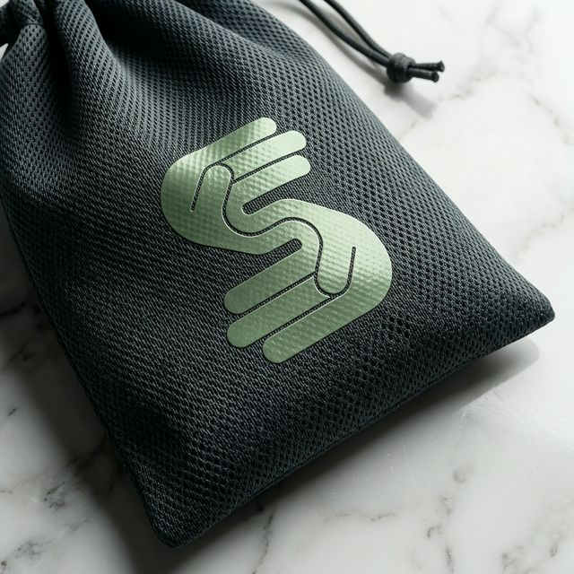
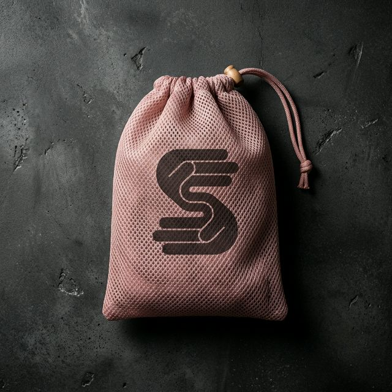
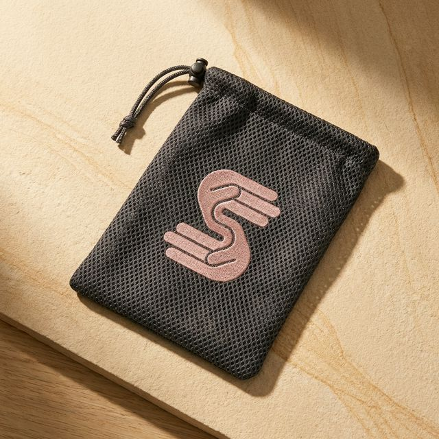

# Mockups Visuales: Packaging de Bolsa de Malla con Logo

**Fecha:** 17 de Febrero, 2026
**Logo:** Diseño "S" estilizada (dos manos formando una S)
**Especificaciones de bolsa:** Bolsas de malla con cordón de 15 × 20 cm

---

## Galería de Mockups

### Opción 1: Bolsa de Malla Blanca



**Especificaciones:**

- **Color:** Blanco puro
- **Material:** Malla de poliéster fina
- **Fondo:** Pizarra oscura (Contraste alto)
- **Logo:** "S" negra centrada
- **Aplicación:** Serigrafía o transferencia de calor

**Ventajas:**

- Estética limpia y premium
- Alto contraste con el logo negro
- Versátil para cualquier color de calcetín
- Look clásico y atemporal

---

### Opción 2: Bolsa de Malla Beige Natural



**Especificaciones:**

- **Color:** Beige natural / crema
- **Material:** Malla de poliéster fina
- **Fondo:** Madera de Nogal oscuro (Contraste alto)
- **Logo:** "S" negra centrada
- **Aplicación:** Serigrafía o bordado

**Ventajas:**

- Estética cálida y orgánica
- Apariencia ecológica
- Alineada con valores de marca sostenible
- Look más suave y cercano

---

### Opción 3: Bolsa de Malla Charcoal con Logo Moss Green



**Especificaciones:**

- **Color:** Gris Charcoal Oscuro
- **Material:** Malla de poliéster fina
- **Fondo:** Mármol Blanco Carrara (Contraste alto)
- **Logo:** "S" Moss Green centrada
- **Aplicación:** Serigrafía o bordado

**Ventajas:**

- Estética audaz, moderna y sofisticada
- Bajo mantenimiento (disimula el desgaste)
- Look técnico de alto rendimiento
- Combinación de colores única y distintiva

---

### Opción 4: Bolsa Dusty Rose con Logo Charcoal



**Especificaciones:**

- **Color:** Dusty Rose (Rosa Palo Desaturado)
- **Material:** Malla de poliéster fina
- **Fondo:** Hormigón Pulido Oscuro (Contraste alto)
- **Logo:** Charcoal Gray centrado al frente
- **Aplicación:** Serigrafía o bordado

**Ventajas:**

- Estética feminista moderna y suave.
- Altamente instagrameable.
- Look premium alineado con tendencias wellness.

---

### Opción 5: Bolsa Charcoal con Logo Dusty Rose



**Especificaciones:**

- **Color:** Dark Charcoal Gray
- **Material:** Malla de poliéster fina
- **Fondo:** Piedra Arenisca Clara (Contraste alto)
- **Logo:** Dusty Rose centrado al frente
- **Aplicación:** Serigrafía o bordado

**Ventajas:**

- Balance perfecto entre técnico y femenino.
- Práctico y distinguido.
- Look profesional y único.

---

## Métodos de Aplicación del Logo

### Serigrafía (Screen Printing) ✅ Recomendado

- **Costo:** $0.05 - $0.15 por bolsa (según volumen)
- **Durabilidad:** Excelente (50+ lavados)
- **Calidad:** Acabado nítido y profesional
- **MOQ:** Típicamente 500+ unidades
- **Ideal para:** Producción de alto volumen

### Bordado

- **Costo:** $0.20 - $0.40 por bolsa
- **Durability:** Excelente (100+ lavados)
- **Calidad:** Tacto premium y relieve
- **MOQ:** Típicamente 250+ unidades
- **Ideal para:** Posicionamiento premium

### Transferencia de Calor (Heat Transfer)

- **Costo:** $0.10 - $0.20 por bolsa
- **Durabilidad:** Buena (30-40 lavados)
- **Calidad:** Buena para logos simples
- **MOQ:** Más bajo (100+ unidades)
- **Ideal para:** Pruebas de lotes pequeños

---

## Recomendaciones de Color

| Color de Bolsa | Color de Logo | Ideal para | Alineación de Marca |
|:---|:---|:---|:---|
| **Blanco** | Negro | Atracción universal, look premium | Moderno, limpio, profesional |
| **Beige Natural** | Negro | Clientes eco-conscientes | Sostenible, orgánico, cálido |
| **Gris Claro** | Negro | Estética contemporánea | Minimalista, sofisticado |
| **Negro** | Blanco | Declaración audaz | Atrevido, atlético, premium |

---

## Comparación de Tamaño

```
Referencia de Tamaño Real (15 × 20 cm):
┌─────────────────┐
│                 │
│                 │  ← 20 cm altura
│       S         │
│                 │
│                 │
└─────────────────┘
    ← 15 cm ancho

Perfecto para:
✓ 1 par de calcetines de yoga/pilates
✓ Presentación compacta
✓ Bolsa de lavado funcional
```

---

## Especificaciones de Producción para el Proveedor

Al realizar el pedido, proporcione estas especificaciones:

```
PRODUCTO: Bolsa de malla con cordón y logo personalizado
TAMAÑO: 15 cm (Ancho) × 20 cm (Alto)
MATERIAL: Malla de poliéster fina (agujeros de 2-3mm)
CIERRE: Cordón de algodón, color a juego con la bolsa
UBICACIÓN LOGO: Centrado al frente, a 5 cm de la parte superior
TAMAÑO LOGO: 4 cm × 4 cm (aproximadamente)
MÉTODO LOGO: Serigrafía (tinta negra)
COLORES NECESARIOS: Blanco y/o Beige Natural
CANTIDAD: [Su cantidad de pedido]
EMPAQUE: Bolsas individuales o a granel
```

---

## Próximos Pasos

1. **Orden de Muestra**
   - Pedir 10-20 muestras en cada color
   - Probar la calidad de la aplicación del logo
   - Validar la durabilidad de la malla
   - Confirmar que el tamaño se ajusta perfectamente al producto

2. **Controles de Calidad**
   - Prueba de lavado (10+ ciclos)
   - Prueba de adhesión del logo
   - Durabilidad del cordón
   - Integridad de la malla

3. **Pedido de Producción**
   - Finalizar la selección de color
   - Confirmar MOQ con el proveedor
   - Solicitar cronograma de producción
   - Organizar la logística de envío

---

## Desglose de Costos (Estimado)

| Componente | Costo por Unidad | Notas |
|:---|:---|:---|
| Bolsa de malla (blanca) | $0.10 - $0.25 | Depende del volumen |
| Aplicación de logo | $0.05 - $0.15 | Serigrafía |
| **Total por bolsa** | **$0.15 - $0.40** | Disminuye con el volumen |

**Ejemplo de Precios por Volumen:**

- 500 unidades: ~$0.35/bolsa
- 1,000 unidades: ~$0.25/bolsa
- 5,000 unidades: ~$0.18/bolsa
- 10,000+ unidades: ~$0.15/bolsa

---

## Análisis: ¿Son estos colores acertados para el público femenino?

Basado en las tendencias de **Activewear Premium (2025-2026)** y la psicología del color en el sector wellness, esta paleta es **altamente efectiva** para mujeres por las siguientes razones:

### 1. Blanco y Beige (La Estética "Clean & Mindful")

- **Por qué funciona:** Son los colores predominantes en estudios de Yoga y Pilates. Transmiten limpieza, calma y un enfoque en materiales naturales (algodón orgánico).
- **Tendencia:** El look "Minimalista Orgánico" es la tendencia nº1 en marcas como Alo Yoga o Lululemon.

### 2. Charcoal y Moss Green (Lo "Earth & Technical")

- **Por qué funciona:** El **Moss Green** (Verde Musgo) es un color extremadamente popular actualmente porque se percibe como un "neutro sofisticado". No es un verde genérico; transmite equilibrio y conexión con la naturaleza.
- **Práctica:** El **Charcoal** es muy valorado por las usuarias por su practicidad: disimula el uso y mantiene una apariencia impecable por más tiempo que el blanco.

### 3. Posicionamiento Premium vs. Retail Masivo

- **Evitar:** Colores "neón" o "rosas brillantes" genéricos, que suelen asociarse con productos de menor calidad o "fast-fashion".
- **Apostar:** Tonos tierra, desaturados y "matificados". Esta paleta comunica que el producto es una **pieza de equipo técnico**, no solo un accesorio de moda.

> [!TIP]
> Si deseas expandir la línea con algo más "suave", podrías considerar un **Dusty Rose (Rosa Palo)** o **Sage (Salvia)**, manteniendo siempre el tono desaturado para no perder el aspecto premium.
